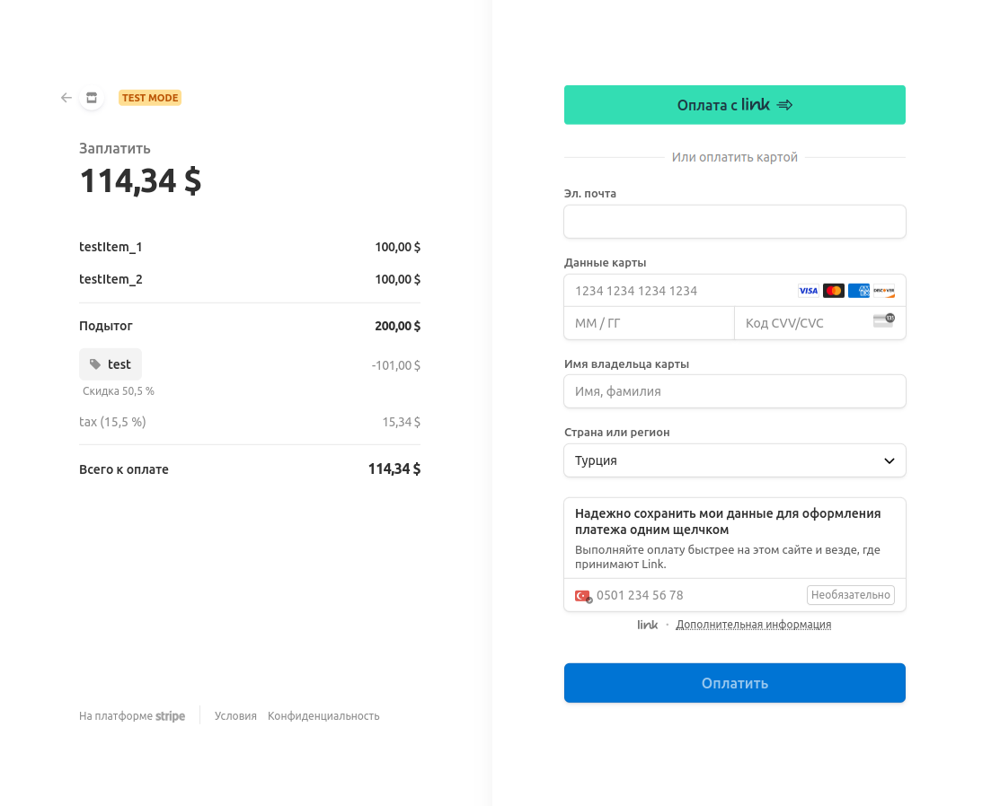
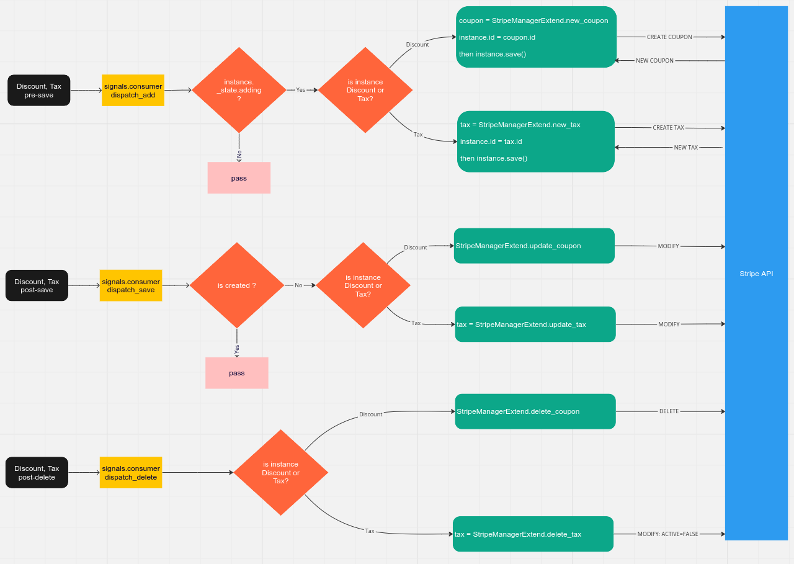

<b>Запуск приложения</b><br><br>
Приложение запускается в контейнерах docker compose:<br>
Тома есть только у nginx<br>
Запуск компоуза `docker compose up`<br>
Остановка компоуза `docker compose down`<br><br>
В корне приложения присутствует Makefile:<br>
Запуск тестов `make test`<br>
Запуск приложение `make run`<br>
Остановить приложение `make stop`<br> 
Пароль от админ-панели `root`, логин указывается в переменной окружения контейнера<br>
После запуска перейти на http://127.0.0.1:81/admin
<br>После добавление items, можно перейти по ссылке вида http://127.0.0.1:81/item/<item_id>
<br>Также приложение временно развернуто на VPS http://google.com

<b>Выполнение задания</b>

Реализовать Django + Stripe API бэкенд со следующим функционалом и условиями:
<i>

· Django Модель Item с полями (name, description, price)  - </i><b>реализовано</b><i>

<br>API с двумя методами:

· GET /buy/{id}, c помощью которого можно получить Stripe Session Id для оплаты выбранного Item. При выполнении этого
метода c бэкенда с помощью python библиотеки stripe должен выполняться запрос stripe.checkout.Session.create(...) и
полученный session.id выдаваться в результате запроса - </i><b>реализовано</b><i>

· GET /item/{id}, c помощью которого можно получить простейшую HTML страницу, на которой будет информация о выбранном
Item и кнопка Buy. По нажатию на кнопку Buy должен происходить запрос на /buy/{id}, получение session_id и далее с
помощью JS библиотеки Stripe происходить редирект на Checkout форму stripe.redirectToCheckout(
sessionId=session_id)  - </i><b>реализовано</b><i>
</i>

<br><b>Бонусные задачи</b>

<i>
· 	Запуск используя Docker

· Использование environment variables - </i><b>реализовано</b><i>

· Просмотр Django Моделей в Django Admin панели - </i><b>реализовано</b><i>

· Запуск приложения на удаленном сервере, доступном для тестирования

· Модель Order, в которой можно объединить несколько Item и сделать платёж в Stripe на содержимое Order c общей
стоимостью всех Items - </i><b>реализовано</b><i>

· Модели Discount, Tax, которые можно прикрепить к модели Order и связать с соответствующими атрибутами при создании
платежа в Stripe - <br>в таком случае они корректно отображаются в Stripe Checkout форме. - </i><b>реализовано</b><i>



· Добавить поле Item.currency, создать 2 Stripe Keypair на две разные валюты и в зависимости от валюты выбранного товара
предлагать оплату в соответствующей валюте

· Реализовать не Stripe Session, а Stripe Payment Intent.
</i>

Дерево проекта
```plaintext
.
├── app
│ ├── asgi.py
│ ├── settings.py
│ ├── urls.py
│ └── wsgi.py
├── docker-compose.yml
├── Dockerfile
├── Makefile
├── manage.py
├── poetry.lock
├── pyproject.toml
├── README.MD
└── stripeapp
    ├── admin.py
    ├── apps.py
    ├── dal.py
    ├── datamodels.py
    ├── migrations
    │ ├── 0001_initial.py
    ├── models.py
    ├── paymentAPI
    │ ├── exception.py
    │ ├── manager.py
    ├── services.py
    ├── signals
    │ ├── consumer.py
    ├── static
    │ ├── script.js
    │ └── style.css
    ├── templates
    │ ├── index.html
    ├── templatetags
    │ ├── custom_filter.py
    ├── tests
    │ ├── conftest.py
    │ ├── docker-compose-test.yml
    │ ├── test_consumer.py
    │ ├── test_dal.py
    │ ├── test_datamodels.py
    │ └── test_manager.py
    ├── urls.py
    └── views.py
```


1. Приложение прослушивает сигналы Джанго на изменение моделей Discount и Tax.<br>
   Схема сигналов (*у сущности Tax в satipeAPI отсутствует возможность удаление. Вместо удаления флаг active ставится в
   false):

   
2. Взаимодействие со stripeAPI реализовано семейством менеджеров.
   UML: 

   

3. Дополнительно добавлены два эндпоинта для получения Order по id и по item_id (то есть второй эндпоинт выведет все заказы, в которых присутствуте товар). ОРМ делает жадный запрос к БД. 
   Эндпоинты:
    GET item/int:id 
    GET buy/int:id
    GET order/int:id
    GET item/by_order/int:id
